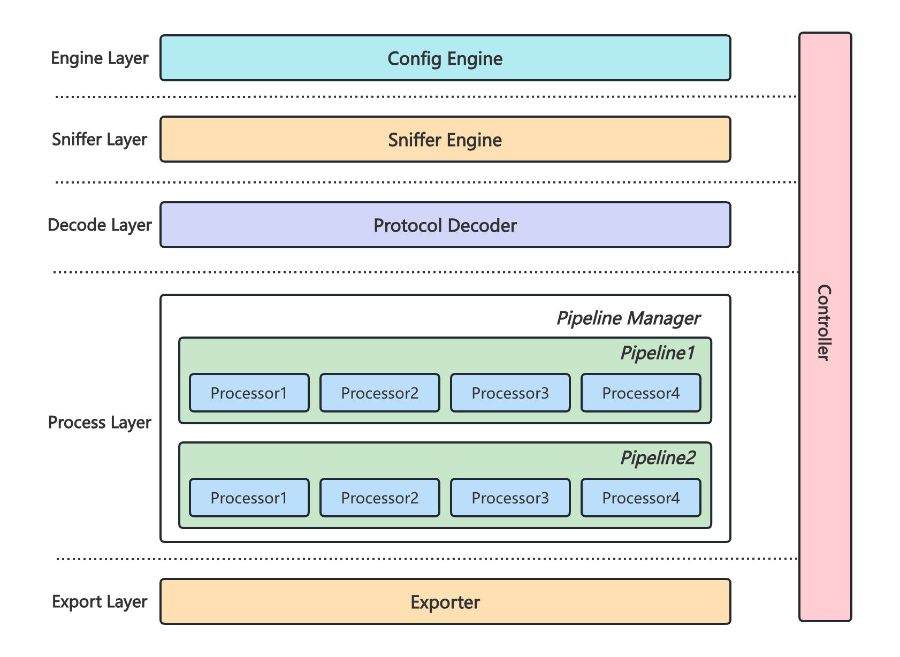

# packetd

> packetd 是一个基于 `libpcap` 的**应用层协议**网络数据无侵观测项目。

packetd 支持从数据流中解析出多种应用协议（HTTP/Grpc/MySQL/Redis/...），使用请求的来回 **RoundTrip** 作为其核心概念，进而衍生出 **Traces/Metrics** 数据。

但由于缺乏上下文关联，Traces 仅能代表当次网络情况的情况，无法关联应用层的 Span，更像是一种 Event/Log 类型的数据，只不过以 Traces 的形式组织起来。

packetd 提供了更加现代化的可观测手段，可以无缝地对接现有的观测体系：
- 支持 Prometheus RemoteWrite 协议上报 Metrics 数据。
- 支持 VictoriaMetrics VmRange Histogram，无需提前定义 bucket。
- 支持 OpenTelemetry 协议上报 Traces 数据。

架构设计如下：



## 🔰 Installation

```shell
$ go install github.com/packetd/packetd@latest
```

## 🚀 Quickstart

详细内容参见 [#Quickstart](./docs/quickstart.md)。

## 📝 Configuration

建议使用 `packetd config > packetd.yaml` 命令生成一个样例文件并按需进行调整，样例文件已对各项配置进行了详细说明。

详细配置参见 [#Config Reference](./cmd/static/packetd.reference.yaml)

## 💡 Protocol

支持的协议列表，参见 [./protocol](./protocol)

- amqp
- dns
- grpc
- http
- http2
- kafka
- mongodb
- mysql
- postgresql
- redis

## 🔍 Observability

packetd 遵循了 Prometheus 以及 OpenTelemetry 社区的 Metrics / Traces 设计。

可通过配置文件的开关选择是否打开数据的上报功能，对于指标提供了 /metrics 接口以及 remotewrite 两种形式。

详细内容参见 [#Observability](./docs/observability.md)。

## 🏅 Benchmark

packetd 支持的每种协议都进行了压测，并输出了相应的压测报告。

详细内容参见 [#Benchamark](./docs/benchmark.md)

## 🤔 Limitation

## 🗂 Roadmap

- 支持 stats 模式
- 内置 web 可视化方案
- kubernetes 部署支持
- 更多的协议支持

## 🔖 License

Apache [©packetd](https://github.com/packetd/packetd/blob/master/LICENSE)
