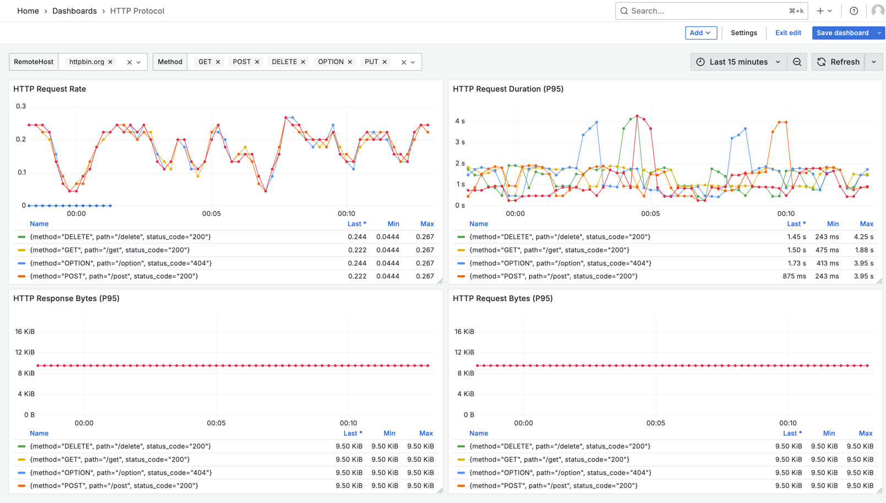
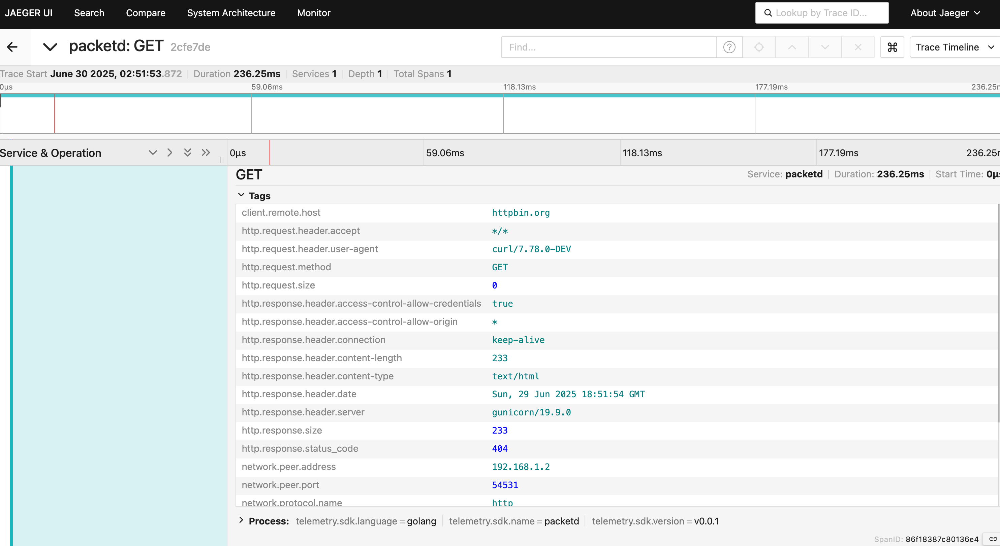
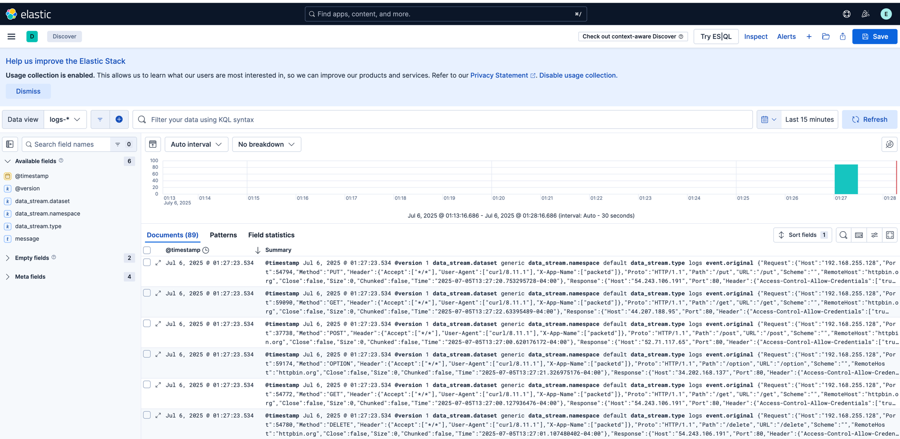

<p align="center">
	
</p>

<p align="center">
    <em>🚀 packetd 是一个基于 `ebpf` 的高性能无侵入网络观测项目</em>
</p>

## 💡 Overview

[tcpdump](https://www.tcpdump.org/) 是一款强大的网络抓包工具，可以结合 [wireshark](https://www.wireshark.org/) 工具对流量进行分析。但是 tcpdump 缺少了一些现代化观测方案联动的手段，比如生成 traces/metrics/logs。另外 tcpdump 更倾向于作为一种 cli 工具，而不是以 agent 模式持续运行。

**So, packetd is born.**

packetd 支持从数据流中解析出多种应用协议（HTTP/gRPC/MySQL/Redis/Kafka/...），使用请求的来回 **roundtrip** 作为其核心概念，进而衍生出 traces/metrics/roundtrips 数据。

在 HTTP/HTTP2/gPRC 协议中，协议头部信息可以携带 `traceparent` 信息，packetd 会继承其 traceID。

对于无法关联 traceID 的请求，由于缺乏上下文信息，traces 仅能代表当次网络情况的情况，无法关联应用层的 span，更像是一种 event/log 类型的数据，只不过以 traces 的形式组织起来。

packetd 提供了更加现代化的可观测手段，可以无缝地对接现有的观测体系：

- 支持 Prometheus /metrics 路由暴露指标。
- 支持 Prometheus RemoteWrite 协议主动上报 Metrics 数据（如 VictoriaMetrics）。
- 支持 OpenTelemetry 协议上报 traces 数据。

## 🔰 Installation

packetd 使用 `libpcap` 作为其底层监听网络包监听方案，因此先安装该依赖库（大部分操作系统已内置）。

*Debian/Ubuntu*

```shell
$ sudo apt-get install libpcap-dev make gcc
```

*CentOS/Fedora*

```shell
$ sudo yum install libpcap libpcap-devel make gcc
```

*Windows*

Windows 系统需要先安装 [npcap](https://nmap.org/npcap/)。

### Install from sourcecode

使用 `go install` 安装二进制文件。

```shell
$ go install github.com/packetd/packetd@latest
```

### Build from sourcecode

```shell
$ git clone https://github.com/packetd/packetd.git
$ make build
# $ mv packetd /usr/local/bin
```

### Download binary

```shell
# https://github.com/packetd/packetd/releases

# 从 release 上选择最新的版本 比如
# version=x.y.z
$ wget https://github.com/packetd/packetd/releases/download/${version}/packetd-v${version}-linux-amd64.tar.gz
```

### Run in Docker

```shell
# 使用 host network 可以观察主机网络情况
$ docker run --network host packetd/packetd watch --proto 'http;80' --ifaces any --console

# 或者将本地配置文件挂载到容器内
$ docker run --network host -v /my/packetd.yaml:/packetd.yaml packetd/packetd agent --config /packetd.yaml 
```

### Run in Kubernetes

示例部署文件 [deploy.yaml](./docs/fixture/deploy.yaml)，可自行调整其 ConfigMap 内容。

```shell
$ kubectl create ns packetd
$ kubectl apply -f deploy.yaml

# 此操作会部署 Daemonset / ConfigMap / Service / ServiceMonitor 多种资源
$ kubectl get -n packetd ds,cm,service,servicemonitor
NAME                     DESIRED   CURRENT   READY   UP-TO-DATE   AVAILABLE   NODE SELECTOR   AGE
daemonset.apps/packetd   5         5         5       5            5           <none>          9h

NAME                           DATA   AGE
configmap/istio-ca-root-cert   1      9h
configmap/kube-root-ca.crt     1      9h
configmap/packetd              1      9h

NAME              TYPE        CLUSTER-IP      EXTERNAL-IP   PORT(S)    AGE
service/packetd   ClusterIP   ....             <none>        9091/TCP   9h

NAME                                           AGE
servicemonitor.monitoring.coreos.com/packetd   9h
```

## 🚀 Quickstart

packetd 支持 `watch` 和 `agent` 两种运行模式。

***watch mode***


***agent mode***


## 🗂 Protocol

packetd 支持的应用层协议列表。

- amqp
- dns
- grpc
- http
- http2
- kafka
- mongodb
- mysql
- postgresql
- redis

## 🔍 Observability

packetd 遵循了 Prometheus 以及 OpenTelemetry 社区的 metrics/traces 设计规范。

可通过配置文件的开关选择是否打开数据的上报功能：

* metrics 提供了 /metrics 接口以及 remotewrite 两种形式。
* traces 提供了 OT HTTP exporter 上报方案。
* roundtrips 可以搭配 ELK 方案进行持久化和检索。

**Prometheus + Grafana**



**OpenTelemetry + Jaeger**



**Elasticsearch + Kibana**



## 📍 Links

* [快速上手](./docs/quickstart.md)
* [架构设计](./docs/design.md)
* [配置选项](./cmd/static/packetd.reference.yaml)
* [可观测数据](./docs/observability.md)
* [API](./docs/api.md)
* [性能压测](./docs/performance.md)

## 🚦 Roadmap

- 支更多协议主流协议。
- 支持采样处理器，维度清洗处理器等。
- 提供 helm-charts 部署模式。
- 构建 Kubernetes Operator，实现 Service 端口协议自发现以及 Workload 信息标签关联。
- 构建 mcp 工具，支持对网络流量进行智能分析？

## 🤔 FQA

***# Q: 是否能处理 TCP 数据流丢包重组问题？***

**不能。**

packetd 是**完全流式**的解析，这也是 packetd 有着良好性能的原因。

- packetd 是面对海量网络流量而设计的，性能是第一原则，缓存数据包会带来大量的计算资源开销。
- 数据包重组是内核的 TCP 栈实现的，应用层的 packetd 进程不持有 FD，且缺乏一些关键的上下文信息，实现难度大。

packetd 使用网卡监方案，因此在网络较差的环境或者在面临海量数据包的时候，应用层会出现丢包现象，调大 buffer 区**一定程度上缓解**丢包情况带来的准确率下降问题。

***# Q: 是否能解析 TLS 链接？***

**不能。**

TLS 数据包的解析需要握手的相关证书信息，从数据包本身是无法推断其内容的，因此 packetd 仅面向**未加密的链接数据流**。

理论上可以使用 `uprobe` 在程序即将写入内核前，即还没对数据包进行加密前进行插桩，那这样就得为**不同的语言不同的版本实现不同的插桩逻辑**，且不保证一定能实现，收益较低。 

***# Q: 为什么选择了 libpcap 而不是更现代的 XDP/TC 等方案？***

**兼容性考量**

libpcap 支持了几乎所有的主流 Linux 发行版（Linux2.2+），有着良好兼容性，而像 XDP/TC 有较高的内核版本要求。

以下表格来自 [pktstat-bpf](https://github.com/dkorunic/pktstat-bpf/blob/main/README.md) 项目文档。

> The following table maps features, requirements and expected performance for described modes:

| Capture type                                        | Ingress | Egress | Performance    | Process tracking | Kernel required | SmartNIC required |
| --------------------------------------------------- | ------- | ------ | -------------- | ---------------- | --------------- | ----------------- |
| Generic [PCAP](https://github.com/dkorunic/pktstat) | Yes     | Yes    | Low            | No               | Any             | No                |
| [AF_PACKET](https://github.com/dkorunic/pktstat)    | Yes     | Yes    | Medium         | No               | v2.2            | No                |
| KProbes                                             | Yes     | Yes    | Medium+        | **Yes**          | v4.1            | No                |
| CGroup (SKB)                                        | Yes     | Yes    | Medium+        | Partial          | v4.10           | No                |
| TC (SchedACT)                                       | Yes     | Yes    | **High**       | No               | v6.6            | No                |
| XDP Generic                                         | Yes     | **No** | **High**       | No               | v5.9            | No                |
| XDP Native                                          | Yes     | **No** | **Very high**  | No               | v5.9            | No                |
| XDP Offloaded                                       | Yes     | **No** | **Wire speed** | No               | v5.9            | **Yes**           |

packetd 也尝试过 XDP 的方案，但性能对比 `AF_PACKET` **没有量级上的提升**，最终在 Linux 上还是仅保留了 `AF_PACKE` 方案。

对于非 Linux 系统（Windows/Darwin/..）`PCAP` 方案也均能支持。综合评估下来，`libpcap` 是一个可接受的方案。

**BPF-Filter 支持**

libpcap 提供了一套 [filter](https://www.tcpdump.org/manpages/pcap-filter.7.html) 语法，可以灵活地对数据包在内核态进行筛选过滤，避免多余的数据包复制开销。

如果使用其他方案就得重新实现一套类似的语法以减少数据拷贝开销。

***# Q: 为什么无法发现任何网卡？***

packetd 可能需要特权模式运行，如果报错可尝试使用 sysadmin 权限运行，如 `root` / `Administrator`。

## 🔖 License

Apache [©packetd](https://github.com/packetd/packetd/blob/master/LICENSE)
