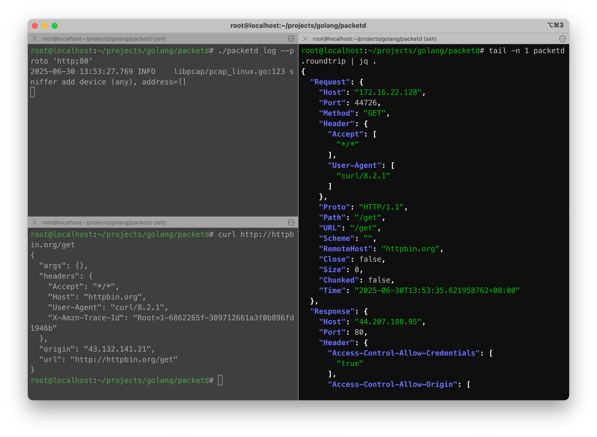
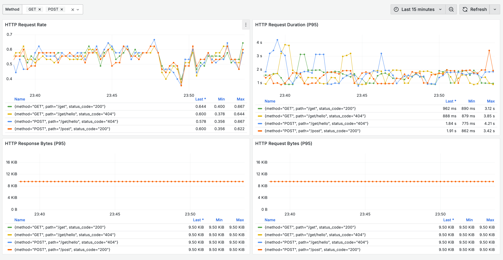

# packetd

> packetd 是一个基于 `ebpf` 的**应用层协议**网络数据无侵观测项目。

packetd 支持从数据流中解析出多种应用协议（HTTP/Grpc/MySQL/Redis/...），使用请求的来回 **RoundTrip** 作为其核心概念，进而衍生出 **Traces/Metrics** 数据。

但由于缺乏上下文关联，Traces 仅能代表当次网络情况的情况，无法关联应用层的 Span，更像是一种 Event/Log 类型的数据，只不过以 Traces 的形式组织起来。

packetd 提供了更加现代化的可观测手段，可以无缝地对接现有的观测体系：

- 支持 Prometheus RemoteWrite 协议上报 Metrics 数据。
- 支持 VictoriaMetrics VmRange Histogram，无需提前定义 bucket。
- 支持 OpenTelemetry 协议上报 Traces 数据。

整体架构图如下：


- 引擎层：负责加载和处理配置数据。
- 监听层：使用 `libpcap` 监听网卡设备或直接加载 `pcap.file` 读取网络数据包，并交由解析层进行协议解析。
- 解析层：负责多种协议的网络包数据解析，并生成 roundtrip。
- 处理层：流式清洗 roundtrip 处理多种协议的 roundtrip 数据（生成 metrics/traces 等）。
- 上报层：将数据上报到不同的存储后端，或者本地文件输出。

## 🔰 Installation

packetd 使用 `libpcap` 作为其底层监听网络包监听方案，因此先安装该依赖库（大部分操作系统已内置）。

**Debian/Ubuntu**

```shell
$ sudo apt-get install libpcap-dev
```

**CentOS/Fedora**

```shell
$ sudo yum install libpcap libpcap-devel
```

**Windows**

Windows 系统需要先安装 [npcap](https://nmap.org/npcap/)。

```shell
$ go install github.com/packetd/packetd@latest
```

## 🚀 Quickstart

packetd 支支持 `log` 和 `agent` 两种运行模式。

**log mode**



**agent mode*


详细内容参见 [#Quickstart](./docs/quickstart.md)。

## 📝 Configuration

建议使用 `packetd config > packetd.yaml` 命令可生成样例文件，并按需进行调整，样例文件已对各项配置进行了详细说明。

详细配置参见 [#Config Reference](./cmd/static/packetd.reference.yaml)。

## 💡 Protocol

支持的协议列表，参见 [#Protocol](./protocol)

- amqp
- dns
- grpc
- http
- http2
- kafka
- mongodb
- mysql
- postgresql
- redis

## 🔍 Observability

packetd 遵循了 Prometheus 以及 OpenTelemetry 社区的 Metrics / Traces 设计。

可通过配置文件的开关选择是否打开数据的上报功能，对于指标提供了 /metrics 接口以及 remotewrite 两种形式。

**Prometheus + Grafana**



**OpenTelemetry + Jaeger**


详细内容参见 [#Observability](./docs/observability.md)。

**Elasticsearch + Kibana**


## 🏅 Benchmark

packetd 支持的每种协议都进行了压测，并输出了相应的压测报告。

详细内容参见 [#Benchamark](./docs/benchmark.md)。

## 🤔 FQA

***# Q: 是否能处理 TCP 数据流丢包重组问题？***

**不能。**

packetd 是**完全流式**的解析，这也是 packetd 有较好性能的原因（性能优化细节可参考 [benchmark](./docs/benchmark.md)）。

- 缓存数据包会占用大量的内存，packetd 是面对海量网络流量而设计的。作为 agent 如果要缓存所有数据流的 TCP 包，那么这个开销几乎是不可接受的。
- 会大幅增加代码的复杂度，数据包重组是内核的 TCP 栈实现的，相当于要在应用层实现一套同样的逻辑，且 packetd 进程是不持有 FD 的，缺乏一些关键的上下文信息，实现难度大。

packetd 使用 `libpcap` 监听了网卡，因此在网络较差的环境中，丢包率可能会上升，协议解析 **Roundtrip** 的达成率会**明显下降**。此时 Layer4 的指标会体现为重复 ack 序号的数据包明显上升。

***# Q: 为什么选择了 libpcap 而不是更现代的 XDP/TC 等方案？***

**兼容性考量**

libpcap 几乎支持了所有的主流 Linux 发行版（Linux2.2+），不存在兼容性问题，而像 XDP/TC 有较高的内核版本要求。

以下表格来自 [pktstat-bpf](https://github.com/dkorunic/pktstat-bpf/blob/main/README.md) 项目文档。

> The following table maps features, requirements and expected performance for described modes:

| Capture type                                        | Ingress | Egress | Performance    | Process tracking | Kernel required | SmartNIC required |
| --------------------------------------------------- | ------- | ------ | -------------- | ---------------- | --------------- | ----------------- |
| Generic [PCAP](https://github.com/dkorunic/pktstat) | Yes     | Yes    | Low            | No               | Any             | No                |
| [AF_PACKET](https://github.com/dkorunic/pktstat)    | Yes     | Yes    | Medium         | No               | v2.2            | No                |
| KProbes                                             | Yes     | Yes    | Medium+        | **Yes**          | v4.1            | No                |
| CGroup (SKB)                                        | Yes     | Yes    | Medium+        | Partial          | v4.10           | No                |
| TC (SchedACT)                                       | Yes     | Yes    | **High**       | No               | v6.6            | No                |
| XDP Generic                                         | Yes     | **No** | **High**       | No               | v5.9            | No                |
| XDP Native                                          | Yes     | **No** | **Very high**  | No               | v5.9            | No                |
| XDP Offloaded                                       | Yes     | **No** | **Wire speed** | No               | v5.9            | **Yes**           |

packetd 也尝试过 XDP 的方案，但性能对于 `AF_PACKET` **没有量级上的提升**，最终在 Linux 上还是仅保留了 `AF_PACKE` 方案。

对于非 Linux 系统（Windows/Darwin/..），`PCAP` 方案均能支持。综合评估下来，`libpcap` 是一个可接受的方案。

*Note: packetd 可能需要特权模式运行，如果报错可尝试使用 sysadmin 权限运行。*

## 🗂 Roadmap

- 支持 stats 模式
- 内置 web 可视化方案
- kubernetes 部署支持
- 更多的协议支持

## 🔖 License

Apache [©packetd](https://github.com/packetd/packetd/blob/master/LICENSE)
