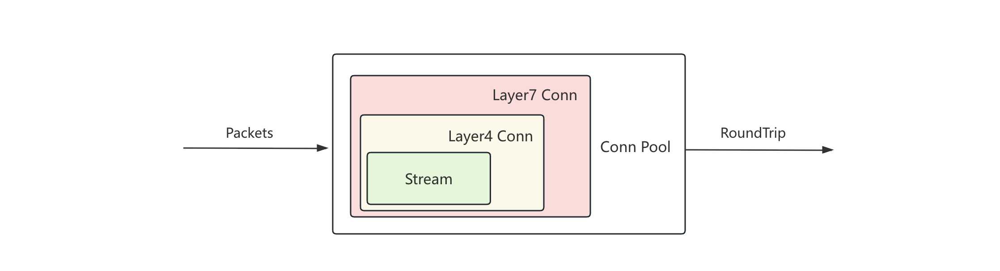
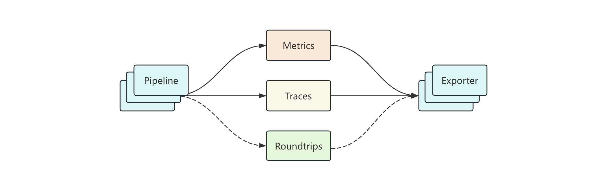

# Design

> 本文档描述了 packetd 整体架构设计思路。

***packetd 架构图：***


- 引擎层：加载和处理配置数据。
- 监听层：监听网卡设备或直接加载 `pcap.file` 读取网络数据包，并交由解析层进行协议解析。
- 解析层：解析多种协议的网络包数据，并生成 roundtrip 交由处理层清洗。
- 处理层：流式清洗多种协议的 roundtrip 数据，并衍生 metrics/traces 数据。
- 上报层：将数据上报到不同的存储后端，或者本地文件输出。

## Decoder Layer

解析层负责承上启下，上接监听层，下接处理层，其内部运行逻辑大致如下：



Stream 表示单向数据流，即 Conn 是由一对 Stream 共同组成的。

```docs
// Conn 代表着 1 条真正的 Layer4 链接 包含两个方向的 Stream
//
// Layer4 Connection
// | ------------------------------------------------ |
// | StreamL                                          |
// | |                                       | Decode |
// | |                              op:Write & [hook] |
// | ==============================================>  |
// |               / zerocopy.buffer /                |
// | <==============================================  |
// | op:Write & [hook]                             |  |
// |          | Decode                             |  |
// |                                          StreamR |
// | ------------------------------------------------ |
//
// 对于链接中的两条 Stream 其状态应该是一致的 即要么都可用 要么都不可用
// Conn 允许在每次执行 Stream Write 操作时挂载 DecodeFunc 保证对数据的流式处理
```

L7 Conn 定义如下：

```golang
// Conn 代表着一个具体协议的应用层的链接
type Conn interface {
	// OnL4Packet 如果正确处理 Layer4 的数据包
	// 返回是否写入成功
	OnL4Packet(seg socket.L4Packet, ch chan<- socket.RoundTrip) error

	// Stats 返回 Conn 统计数据
	Stats() []connstream.TupleStats

	// Free 释放链接相关资源
	Free()

	// IsClosed 返回链接是否关闭
	IsClosed() bool

	// ActiveAt 返回链接最后活跃时间
	ActiveAt() time.Time
}
```

sniffer 嗅探到数据包之后，将数据写入至一个虚拟的 Stream，封装完成后对外以 Conn 形式提供。对于 TCP 数据包，会做一些过滤以及标记，比如丢弃重复的包，处理 `FIN` 信号等。

当 Layer7 拿到数据包后，会根据端口选择对应的协议（每种协议都会实现各自的 decoder），然后再生成 decoder 实例进行解析。

```golang
// Decoder 协议解码器定义
//
// 所有的 7 层协议解码器都需实现本接口 要求实现方支持流式解析数据
type Decoder interface {
	// Decode 解析数据 不允许修改任何 Reader 读取到的任何字节
	// 如果有修改需求 请先 copy 一份
	//
	// r 是 L4 `已经切割的数据流`
	// t 为数据包被抓取的时间
	//
	// 同有一个数据包可能会解析出多个 *role.Object
	Decode(r zerocopy.Reader, t time.Time) ([]*role.Object, error)

	// Free 释放持有的资源
	Free()
}
```

当 Decoder 解析成功，判定其为 `Request` / `Response`，再提交给到 `role.Matcher` 进行匹配，匹配成功则生成 roundtrip 继续后续流程。

## Process Layer

处理层主要负责将 roundtrip 衍生出 traces/metrics 可观测数据。



processor 初始化时注册，由配置文件决定是否启用，pipeline 同理。

```golang
// Processor 定义了数据处理接口的行为
//
// Processor 负责处理所有类型的 *common.Record 数据 即 roundtrips/metrics/traces
type Processor interface {
	// Name 返回处理器的名称
	Name() string

	// Process 处理 *Common.Record 数据 并返回衍生数据（如果存在的话）
	Process(*common.Record) (*common.Record, error)

	// Clean 清理资源
	Clean()
}
```

processor 由 pipeline 调度，pipeline 会在每条数据进来时执行 pipeline 定义的所有的 processor。
