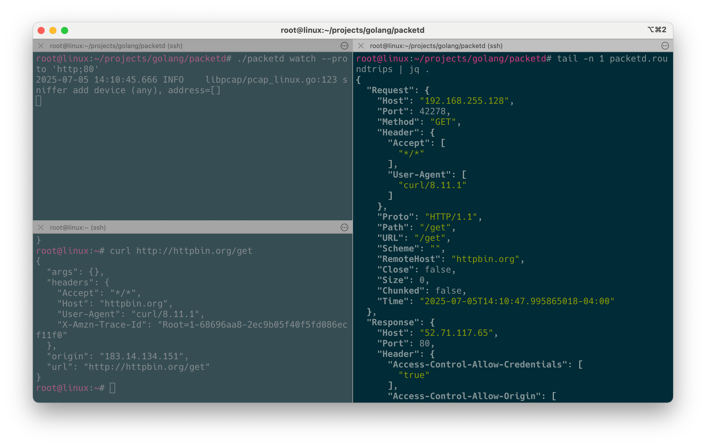
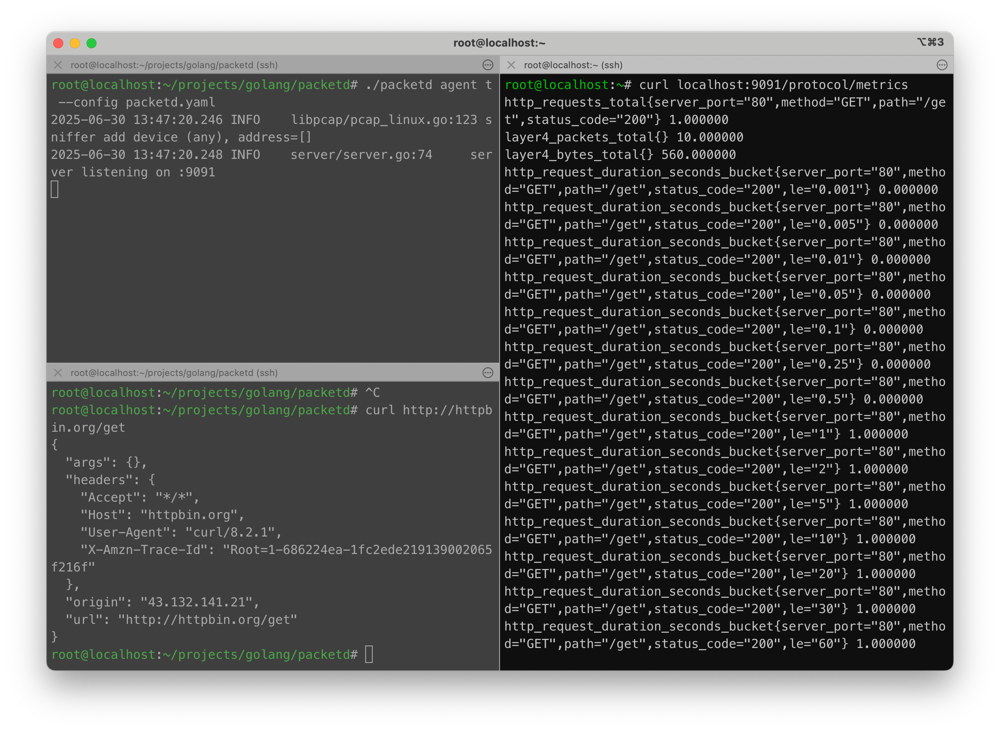

# Quickstart

> 本文档描述如何快速入手 packetd 工具以及了解其输出数据格式。

packetd 提供了 agent 和 watch 两种运行模式，前者使用 agent 模式持续监听网络包并工作，后者作为一种 cli 工具 debug 网络请求。

```shell
$ packetd
# packetd is a eBPF-powered network traffic capture and analysis project

Usage:
  packetd [command]

Available Commands:
  agent       Run in network monitoring agent mode
  config      Prints the reference configuration
  help        Help about any command
  ifaces      List all available interfaces
  version     Display version information
  watch       Capture and log network traffic roundtrips

Flags:
  -h, --help   help for packetd

Use "packetd [command] --help" for more information about a command.
```

packetd 项目启动需要指定配置文件，watch 模式本质上是以一份内置配置模版运行，详见 [#watchConfig](../cmd/watch.go)。

可通过 `packetd config` 子命令查看所有配置项内容，或者通过 `packetd config > packetd.yaml` 生成配置文件模板再按需调整。

通过 ifaces 子命令查看支持监听的网卡设备，如：

```shell
$ packetd ifaces
- lo: [127.0.0.1/8 ::1/128]
- ens160: [172.16.22.128/24 fe80::20c:29ff:fe11:428c/64]
- docker0: [172.17.0.1/16]
- br-05d5cdd6d4c9: [172.18.0.1/16]
```

## watch 模式



watch 模式是一种简化的 packetd 项目运行方式，可以免配置文件快速启用 packetd 的数据观测能力。(如若报错可尝试使用 root 权限执行）

```shell
$ packetd watch --ifaces any  --proto 'http;80' --console
2025-06-22 15:58:25.278 INFO    logger/logger.go:136    sniffer add device (any), address=[]
```

接着在任意 terminal 中访问任意 80 端口的 HTTP 服务，以 [http://httpbin.org](http://httpbin.org) 为例：

```shell
2025-07-06 12:36:43.246	INFO	libpcap/pcap_linux.go:123	sniffer add device (any), address=[]
{"Request":{"Host":"192.168.255.128","Port":36654,"Method":"GET","Header":{"Accept":["*/*"],"User-Agent":["curl/8.11.1"]},"Proto":"HTTP/1.1","Path":"/get","URL":"/get","Scheme":"","RemoteHost":"httpbin.org","Close":false,"Size":0,"Chunked":false,"Time":"2025-07-06T12:36:51.49809695-04:00"},"Response":{"Host":"54.243.106.191","Port":80,"Header":{"Access-Control-Allow-Credentials":["true"],"Access-Control-Allow-Origin":["*"],"Connection":["keep-alive"],"Content-Length":["255"],"Content-Type":["application/json"],"Date":["Sun, 06 Jul 2025 16:36:51 GMT"],"Server":["gunicorn/19.9.0"]},"Status":"200 OK","StatusCode":200,"Proto":"HTTP/1.1","Close":false,"Size":255,"Chunked":false,"Time":"2025-07-06T12:36:52.044846786-04:00"},"Duration":"546.749836ms"}
```

`jq` 格式化查看：
```json
{
  "Request": {
    "Host": "192.168.255.128",
    "Port": 36654,
    "Method": "GET",
    "Header": {
      "Accept": [
        "*/*"
      ],
      "User-Agent": [
        "curl/8.11.1"
      ]
    },
    "Proto": "HTTP/1.1",
    "Path": "/get",
    "URL": "/get",
    "Scheme": "",
    "RemoteHost": "httpbin.org",
    "Close": false,
    "Size": 0,
    "Chunked": false,
    "Time": "2025-07-06T12:36:51.49809695-04:00"
  },
  "Response": {
    "Host": "54.243.106.191",
    "Port": 80,
    "Header": {
      "Access-Control-Allow-Credentials": [
        "true"
      ],
      "Access-Control-Allow-Origin": [
        "*"
      ],
      "Connection": [
        "keep-alive"
      ],
      "Content-Length": [
        "255"
      ],
      "Content-Type": [
        "application/json"
      ],
      "Date": [
        "Sun, 06 Jul 2025 16:36:51 GMT"
      ],
      "Server": [
        "gunicorn/19.9.0"
      ]
    },
    "Status": "200 OK",
    "StatusCode": 200,
    "Proto": "HTTP/1.1",
    "Close": false,
    "Size": 255,
    "Chunked": false,
    "Time": "2025-07-06T12:36:52.044846786-04:00"
  },
  "Duration": "546.749836ms"
}
```

packetd 捕获了一个完整的 HTTP 请求，并结构化地输出请求明细，考虑到请求体和响应体的内容可能会比较大，这里仅记录了 BodySize。

除了输出到 console，还可以输出到指定文件，如 `--roundtrips.file packetd.roundtrips`。

```shell
$ packetd watch -h
Capture and log network traffic roundtrips

Usage:
  packetd watch [flags]

Examples:
# packetd watch --proto 'http;80,8080' --proto 'dns;53' --ifaces any --console

Flags:
      --console                  Enable console logging
  -h, --help                     help for watch
      --ifaces string            Network interfaces to monitor (supports regex), 'any' for all interfaces (default "any")
      --ipv string               Filter by IP version [v4|v6]. Defaults to both
      --no-promisc               Don't put the interface into promiscuous mode
      --pcap-file string         Path to pcap file to read from
      --proto strings            Protocols to capture in 'protocol;ports[;host]' format, multiple protocols supported
      --roundtrips.backups int   Maximum number of old roundtrips files to retain (default 10)
      --roundtrips.file string   Path to roundtrips file (default "packetd.roundtrips")
      --roundtrips.size int      Maximum size of roundtrips file in MB (default 100)

```

packetd 除了支持从网卡直接捕获网络数据，还支持加载 pcap 文件，如：

```shell
$ packetd watch --pcap.file /my/app.pcap --console
```

## agent 模式



agent 模式则需要显式指定配置文件，默认为 `packetd.yaml`，启动命令 `packetd agent --config packetd.yaml`。

```yaml
# packetd.yaml
server:
  enabled: true
  address: ":9091"

logger.stdout: true
controller:
  layer4Metrics:
    enabled: true

sniffer.ifaces: 'any'
sniffer.engine: pcap
sniffer.protocols:
  rules:
    - name: "http"
      protocol: "http"
      ports: [80]

processor:
  - name: roundtripstometrics
    config:
      http:
        requireLabels:
          - "request.remote_host"
          - "request.method"
          - "request.path"
          - "response.status_code"

pipeline:
  - name: "metrics/common"
    processors:
      - roundtripstometrics

metricsStorage:
  enabled: true

# 这里仅做指标暴露 不输出其他任何内容 详细配置参见 packetd.reference.yaml
exporter:
```

同样在新终端中访问任意 80 端口的 HTTP 服务，如：

```shell
$ curl httpbin.org
```

访问 9091 端口查看 `/protocol/metrics` API 的 metrics 数据。每种协议都默认提供了包括请求耗时、请求体大小、响应体大小、请求总数等指标。

```shell
$ curl localhost:9091/protocol/metrics
tcp_received_bytes_total{} 563.000000
tcp_skipped_packets_total{} 0.000000
http_requests_total{remote_host="httpbin.org",method="GET",path="/get",status_code="200"} 1.000000
tcp_received_packets_total{} 12.000000
tcp_active_conns{} 1.000000
http_request_duration_seconds_bucket{remote_host="httpbin.org",method="GET",path="/get",status_code="200",le="0.001"} 0.000000
http_request_duration_seconds_bucket{remote_host="httpbin.org",method="GET",path="/get",status_code="200",le="0.005"} 0.000000
http_request_duration_seconds_bucket{remote_host="httpbin.org",method="GET",path="/get",status_code="200",le="0.01"} 0.000000
http_request_duration_seconds_bucket{remote_host="httpbin.org",method="GET",path="/get",status_code="200",le="0.05"} 0.000000
http_request_duration_seconds_bucket{remote_host="httpbin.org",method="GET",path="/get",status_code="200",le="0.1"} 0.000000
http_request_duration_seconds_bucket{remote_host="httpbin.org",method="GET",path="/get",status_code="200",le="0.25"} 1.000000
http_request_duration_seconds_bucket{remote_host="httpbin.org",method="GET",path="/get",status_code="200",le="0.5"} 1.000000
http_request_duration_seconds_bucket{remote_host="httpbin.org",method="GET",path="/get",status_code="200",le="1"} 1.000000
http_request_duration_seconds_bucket{remote_host="httpbin.org",method="GET",path="/get",status_code="200",le="2"} 1.000000
http_request_duration_seconds_bucket{remote_host="httpbin.org",method="GET",path="/get",status_code="200",le="5"} 1.000000
http_request_duration_seconds_bucket{remote_host="httpbin.org",method="GET",path="/get",status_code="200",le="10"} 1.000000
http_request_duration_seconds_bucket{remote_host="httpbin.org",method="GET",path="/get",status_code="200",le="20"} 1.000000
http_request_duration_seconds_bucket{remote_host="httpbin.org",method="GET",path="/get",status_code="200",le="30"} 1.000000
http_request_duration_seconds_bucket{remote_host="httpbin.org",method="GET",path="/get",status_code="200",le="60"} 1.000000
http_request_duration_seconds_bucket{remote_host="httpbin.org",method="GET",path="/get",status_code="200",le="120"} 1.000000
http_request_duration_seconds_bucket{remote_host="httpbin.org",method="GET",path="/get",status_code="200",le="300"} 1.000000
http_request_duration_seconds_bucket{remote_host="httpbin.org",method="GET",path="/get",status_code="200",le="600"} 1.000000
http_request_duration_seconds_bucket{remote_host="httpbin.org",method="GET",path="/get",status_code="200",le="+Inf"} 1.000000
...
```

packetd 本身自监控指标可通过 `/metrics` 访问查看，[API 文档](./api.md)。

## 配置热重载

packetd 支持运行时热重载 Protocol Rules（仅 agent 模式下生效），有两种方式触发重载：

- `kill -HUP $pid`
- `curl -XPOST $host:$port/-/reload`
