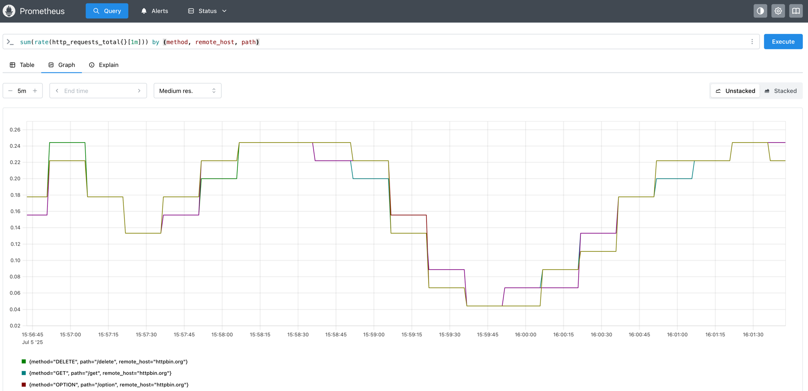
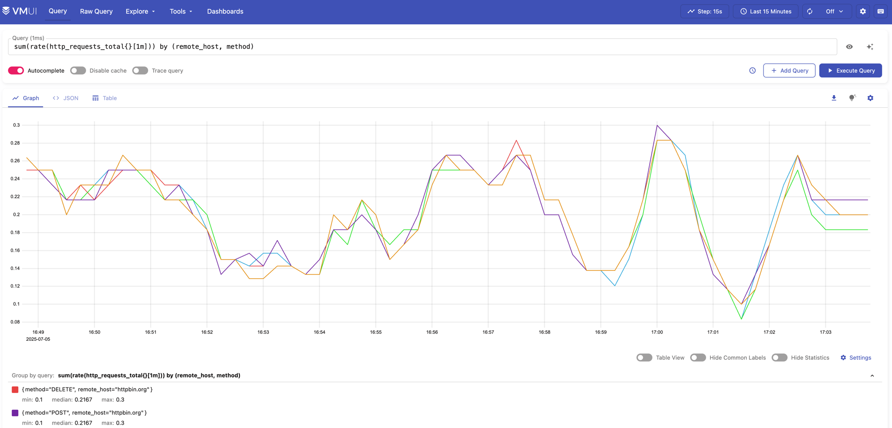
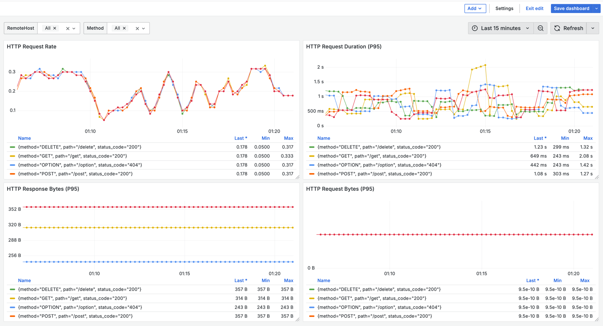

# Visualization

> 本文档描述如何配合社区的可观测方案将 packetd 产生的数据进行持久化及可视化。

社区上已经有非常多的关于下述产品的介绍文档，具体细节这里就不再一一展开，仅聚焦于如何搭配 packetd 进行使用。

*Note: 本文档中的社区组件搭建方式只做演示用途，生产环境请选择 **分布式或者集群化** 版本搭建。*

## Prometheus + Grafana

[Prometheus](https://prometheus.io/) 是社区非常主流的指标方案，影响力要远大于 OpenTelemetry/Metrics 方案。[grafana](https://grafana.com/) 是非常优秀的可视化方案的集大成者。

packetd 提供了 /metrics 接口暴露指标信息，同时也支持 remotewrite 形式将数据写入任何支持 Prometheus 协议的后端（比如 VictoriaMetrics）。

在 packetd 正常运行后并监听了服务端口后，假设为 `localhost:9091`，则此时应该可以通过访问对应路由查看指标数据。

```shell
$ curl localhost:9091/metrics
$ curl localhost:9091/protocol/metrics
```

这里以 HTTP 协议为例，在监听到请求之后就可以使用 Prometheus 进行数据采集以及使用 Grafana 做数据展示。

启动 packetd 并监听 HTTP 80 端口，指定指标维度配置。

```yaml
sniffer.protocols:
  rules:
    - name: "http"
      protocol: "http"
      ports: [80]
      
processor:
  - name: roundtripstometrics
    config:
      http:
        requireLabels:
          - "server.host"
          - "server.port"
          - "request.method"
          - "request.path"
          - "request.remote_host"
          - "response.status_code"
```

可以在新终端执行以下脚本，持续访问 http://httpbin.org 测试请求效果。

```shell
HEADER="X-APP-NAME: packetd"

while true; do
  curl -H "$HEADER" http://httpbin.org/get
  curl -H "$HEADER" -X POST http://httpbin.org/post
  curl -H "$HEADER" -X DELETE http://httpbin.org/delete
  curl -H "$HEADER" -X PUT http://httpbin.org/put
  curl -H "$HEADER" -X OPTION http://httpbin.org/option
done
```

**1) 搭建 Prometheus**

可在 [prometheus.io/download](https://prometheus.io/download/) 页面下载对应系统架构版本的 Prometheus 构建包，解压后修改 `prometheus.yml`，新增 packetd 采集。

```yaml
scrape_configs:
  - job_name: "packetd"
    metrics_path: "/metrics"
    static_configs:
      - targets: ["localhost:9091"]
        labels:
          app: "packetd"

  - job_name: "packetd-protocol"
    metrics_path: "/protocol/metrics"
    static_configs:
      - targets: ["localhost:9091"]
        labels:
          app: "packetd-protocol"
```

接着运行 `./prometheus` 进程。Prometheus 自身提供了一套查询的 UI，访问 [http://localhost:9090](http://localhost:9090) 可查看。



**2）搭建 Grafana**

使用 docker 一键部署。

```shell
$ docker run -d -p 3000:3000 --name=grafana grafana/grafana
```

在 `Connections > Data sources` 新增 `prometheus` 数据源后，即可通过仪表盘观测 packetd 产生的指标数据。


prometheus-grafana 配置样例文件位于 [fixture/prometheus.json](fixture/prometheus.json)。

## VictoriaMetrics + Grafana

[VictoriaMetrics](https://docs.victoriametrics.com) 是一个兼容 Prometheus 生态的 TSDB，提供了更优秀的性能以及集群化方案，也是目前的主流方案之一。

**1) 搭建 VictoriaMetrics**

官网文档提供了多种安装方式 [victoriametrics/quick-start](https://docs.victoriametrics.com/victoriametrics/quick-start/)，可挑选任意一种方式安装启动。

packetd 配置 remotewrite 协议 exporter，将数据写入到 VictoriaMetrics 中。

```yaml
# 启动 metrics exporter
exporter:
  metrics:
    enabled: true
    endpoint: http://localhost:8428/api/v1/write # victoriametrics remotewrite API
    interval: 15s

# vm 支持了更加智能的 Histogram 类型数据，可将 `le` 转换为 `vmrange`，降低 bucket 的维度成本。
# 详见 https://valyala.medium.com/improving-histogram-usability-for-prometheus-and-grafana-bc7e5df0e350
metricsStorage:
  vmHistogram: true # 启用 vmrange
```

VictoriaMetrics 也内置了 vmui，可直接访问 [http://localhost:8428/vmui](http://localhost:8428/vmui)。



**2) 配置 Grafana**

同样的，在 `Connections > Data sources` 新增 `victoriametrics` 数据源后导入仪表盘。



可以观察到，启用了 `vmrange` 特性之后数据准确性更高，因为提前定义 bucket 不能很好的涵盖所有场景，比如这里的 `Request Size`，实际请求是没有 Body 的。

victoriametrics-grafana 配置样例文件位于 [fixture/victoriametrics.json](fixture/victoriametrics.json)。

## OpenTelemetry + Jaeger

[OpenTelemetry](https://opentelemetry.io/) 是新一代的可观测标准，涵盖了 metrics/traces/logs 三种类型的数据。[Jaeger](https://www.jaegertracing.io/) 是一个开源的分布式链路追踪系统。

同样的，可以使用 docker 一键启动其 [all-in-one](https://www.jaegertracing.io/docs/1.6/getting-started/) 镜像。

```shell
$ docker run -d --name jaeger \
  -e COLLECTOR_ZIPKIN_HOST_PORT=:9411 \
  -p 16686:16686 \
  -p 4317:4317 \
  -p 4318:4318 \
  -p 14250:14250 \
  -p 14268:14268 \
  -p 14269:14269 \
  -p 9411:9411 \
  jaegertracing/all-in-one
```

packetd 支持通过 HTTP exporter 的方式将 traces 数据写入至支持 OpenTelemetry 协议的后端，配置如下：

```yaml
# pipeline 启动 roundtriptotraces 处理器
pipeline:
  - name: "traces/common"
    processors:
      - roundtripstotraces

# exporter 启动 traces 上报
exporter:
  traces:
    enabled: true
    endpoint: http://localhost:4318/v1/traces
    batch: 10
    interval: 3s
```

当请求被捕获后，即可在 Jaeger 提供的页面 UI [http://localhost:16686](http://localhost:16686/) 进行检索。


## Elasticsearch + Kibana

[ELK](https://www.elastic.co/elastic-stack) 是一个应用套件，由 Elasticsearch、Logstash、Kibana 三部分组成，简称 ELK。是目前主流的日志检索方案之一。

搭建方案可参考 [deviantony/docker-elk](https://github.com/deviantony/docker-elk)，按照文档提示逐步操作即可，同时需要将 packetd 的 roundtrips 输出打开。

```yaml
# 启动 roundtrips 本地文件输出
exporter:
  roundtrips:
    enabled: true
    filename: "packetd.roundtrips"
```

roundtrips 数据将会写入至 `packetd.roundtrips` 文件，可使用 `nc` 命令将数据导入至 Elasticsearch。

```shell
$ cat packetd.roundtrips | nc --send-only localhost 50000
```

访问 [http://localhost:5601](http://localhost:5601/app/discover) 进行日志的检索。


